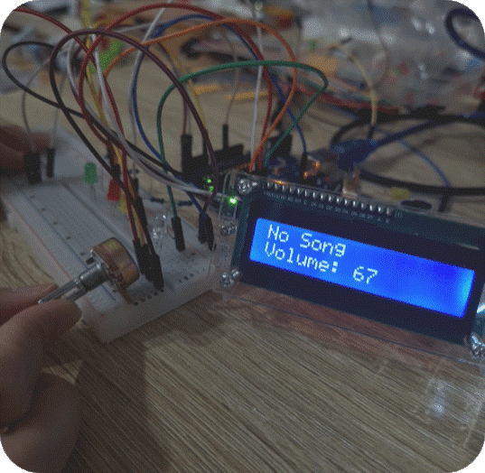
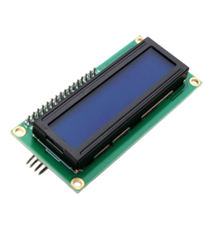
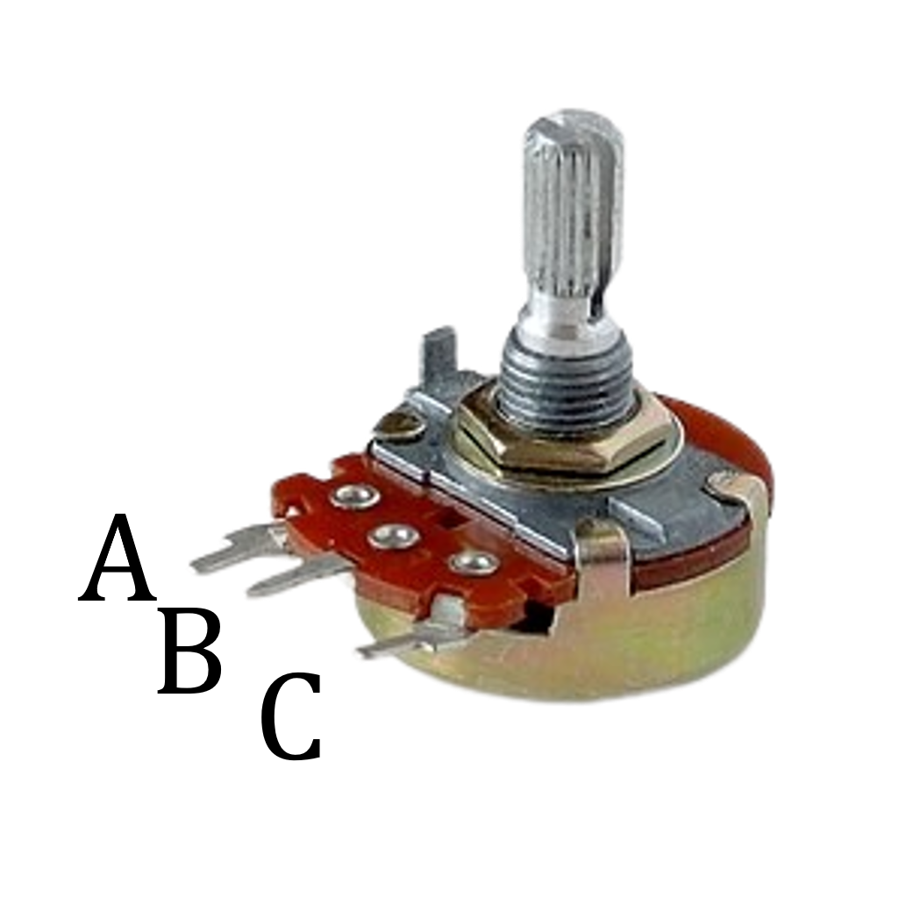

# Gesture-Based-Music-Playback-with-Interactive-UI
Goal: Using Mediapipe Gestures to Play Music and Display Results in the UI

## 📖 Introduction
This project combines gesture recognition using MediaPipe and OpenCV with Arduino hardware to create a music control system. Hand gestures control music playback, track switching, and volume, with real-time feedback on an LED indicator, UI, and 1602 LCD.

## 🛠 Equipment
| Component               | Purpose                                    |
|-------------------------|--------------------------------------------|
| Arduino Uno             | Microcontroller for hardware integration  |
| LED                     | Indicator for gesture-based actions       |
| 1602 LCD                | Displays the current song name            |
| Variable Resistor (10K) | Adjusts the music volume                  |
| Breadboard & Dupont Line| Prototyping connections                   |

## 🖥 Features
1. **Gesture Recognition**  
   - Utilizes **MediaPipe** and **OpenCV** for recognizing specific hand gestures.

2. **Music Control, LED Indicator, and UI Feedback**  
   - Gestures control music playback and track switching.
   - LED colors indicate the current action.
   - A user interface displays playback status and song information.

3. **Current Song Display**  
   - The 1602 LCD shows the current song name in real time.

4. **Volume Control**  
   - The variable resistor adjusts its resistance value, which is sent back to Python to adjust the computer's volume accordingly.

---

## 🚀 System Workflow

### Gesture Recognition Process
1. OpenCV and MediaPipe detect gestures.
2. The gesture results and song name are returned to the Arduino via I2C.
3. LEDs and the UI reflect the current playback status.


### Volume Adjustment Process
<div style="display: flex; align-items: center;">
  <!-- 左邊的流程圖 -->
  

  <!-- 右邊的 GIF 圖片 -->
  
</div>

---

## ✋ Gesture Controls
| Gesture      | Action         | LED Color  |
|--------------|----------------|------------|
| Hand Open    | Play     | Green  |
| OK                     | Pause    | Red    |
| One Finger  | Previous | White  |
| Two Fingers| Next    | Yellow |

---

## 🔌 Arduino UNO Pin Mapping

### I2C Connections
| Pin   | Arduino Uno Pin |
|-------|-----------------|
| VCC   | 5V             |
| GND   | GND            |
| SDA   | A4             |
| SCL   | A5             |


### Variable Resistor Connections
| Pin   | Arduino Uno Pin |
|-------|-----------------|
| A     | VCC            |
| B     | A0             |
| C     | GND            |



---

## 📋 Requirements
- Python 3.11.5
- MediaPipe
- OpenCV
- Arduino IDE
- Necessary libraries for the 1602 LCD and I2C communication.

---

## 🛠 Setup Instructions
1. **Hardware Assembly**  
   - Connect the Arduino to the LED, 1602 LCD, and variable resistor as per the pin mapping table.
   #### Arduino System Wiring


2. **Install Dependencies**  
```python
 !pip install opencv-python mediapipe serial pygame
```
3. **Note:** 
   - If your hand gestures are not being recognized or detected properly, **try adjusting the `angle`** of your computer camera or moving to a **`well-lit area`** for testing.

---

## 👀🎥Demo (Video)
   [](https://youtu.be/KCkU5Yah4kM)


